# `marketplace/packages/trading-platform/templates/rust/src/lib.rs`

Source SHA-256: `768eb8dd2fd392fa603a5175b8da8cf9f849921b128b5aa6d0cf0fc49c5699c6`

```mermaid
classDiagram
    class type_OrderId {
      <<type>>
    }
    class type_Price {
      <<type>>
    }
    class type_Quantity {
      <<type>>
    }
    class enum_Side {
      <<enum>>
    }
    class enum_OrderType {
      <<enum>>
    }
    class enum_OrderStatus {
      <<enum>>
    }
    class enum_TimeInForce {
      <<enum>>
    }
    class struct_Order {
      <<struct>>
      +"order_id: OrderId"
      +"client_order_id: String"
      +"symbol: String"
      +"side: Side"
      +"order_type: OrderType"
      +"quantity: Quantity"
      +"price: Option~Price~"
      +"time_in_force: TimeInForce"
      +"status: OrderStatus"
      +"filled_quantity: Quantity"
      +"average_fill_price: Option~Price~"
      +"timestamp: DateTime~Utc~"
    }
    class struct_Fill {
      <<struct>>
      +"fill_id: String"
      +"order_id: OrderId"
      +"price: Price"
      +"quantity: Quantity"
      +"timestamp: DateTime~Utc~"
    }
    class struct_Trade {
      <<struct>>
      +"trade_id: String"
      +"symbol: String"
      +"price: Price"
      +"quantity: Quantity"
      +"buyer_order_id: OrderId"
      +"seller_order_id: OrderId"
      +"timestamp: DateTime~Utc~"
    }
    class struct_PriceLevel {
      <<struct>>
      +"price: Price"
      +"quantity: Quantity"
      +"orders: VecDeque~OrderId~"
    }
    class struct_OrderBook {
      <<struct>>
      +"symbol: String"
      +"bids: BTreeMap~Price"
      +"asks: BTreeMap~Price"
      +"orders: HashMap~OrderId"
    }
    class struct_MatchingEngine {
      <<struct>>
      +"order_books: HashMap~String"
      +"fills: Vec~Fill~"
      +"trades: Vec~Trade~"
    }
    class mod_tests {
      <<mod>>
    }
    note "MatchingEngine"
    note "OrderBook"
```

## Dependencies

- `chrono::{DateTime, Utc}`
- `rust_decimal::Decimal`
- `serde::{Deserialize, Serialize}`
- `std::collections::{BTreeMap, HashMap, VecDeque}`
- `std::sync::{Arc, Mutex}`
- `super::*`

## Standing

- Structural parse: `ALIVE`
- Runtime behavior: `UNKNOWN`
