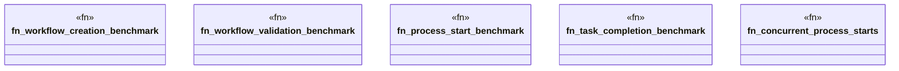

# `marketplace/packages/workflow-engine-cli/benches/workflow_benchmarks.rs`

Source SHA-256: `70a7a6b1c45e60bf98b1138e46bb92927789bbeb7178e78a359d270cc34dfc24`

## Dependencies

- `criterion::{black_box, criterion_group, criterion_main, Criterion, BenchmarkId}`
- `workflow_engine::prelude::*`

## Standing

- Structural parse: `ALIVE`
- Runtime behavior: `UNKNOWN`
