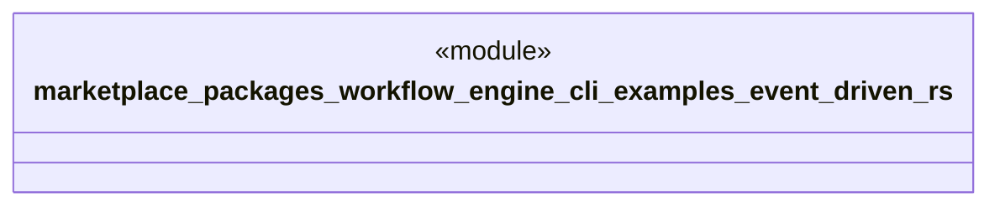

# `marketplace/packages/workflow-engine-cli/examples/event_driven.rs`

Source SHA-256: `e1f90d2e2a4e6a5f3c02da0de9554ecf3ece1c3e552050b00a41564d365f58dd`

## Dependencies

- `workflow_engine::prelude::*`

## Standing

- Structural parse: `ALIVE`
- Runtime behavior: `UNKNOWN`
