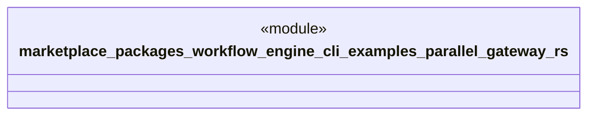

# `marketplace/packages/workflow-engine-cli/examples/parallel_gateway.rs`

Source SHA-256: `68cfe0cf6ba0b115ef200853de903c1279b61306271b397cd6a34a5091b2ce2d`

## Dependencies

- `workflow_engine::prelude::*`

## Standing

- Structural parse: `ALIVE`
- Runtime behavior: `UNKNOWN`
