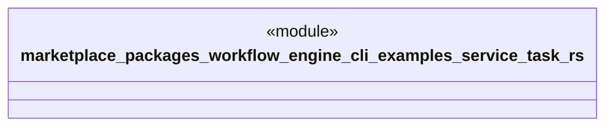

# `marketplace/packages/workflow-engine-cli/examples/service_task.rs`

Source SHA-256: `66c9a232a997aafa1d3de22c48ee902bf928a5e177009f5902c4f8ac08edcca9`

## Dependencies

- `workflow_engine::prelude::*`

## Standing

- Structural parse: `ALIVE`
- Runtime behavior: `UNKNOWN`
