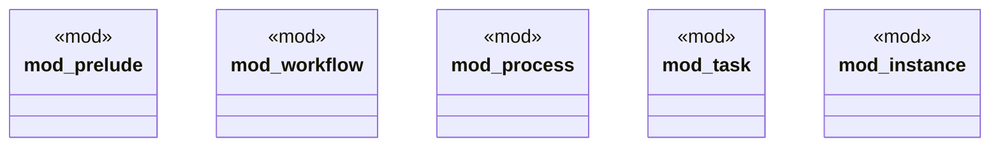

# `marketplace/packages/workflow-engine-cli/src/lib.rs`

Source SHA-256: `6ca717531e9596509ead2b03d7b7e336f53658087057285e3c75f0527173534f`

## Dependencies

- `anyhow::Result`
- `anyhow::{Result, anyhow}`
- `crate::instance::*`
- `crate::process::*`
- `crate::task::*`
- `crate::workflow::*`
- `serde::{Deserialize, Serialize}`
- `serde_json::Value`

## Standing

- Structural parse: `ALIVE`
- Runtime behavior: `UNKNOWN`
