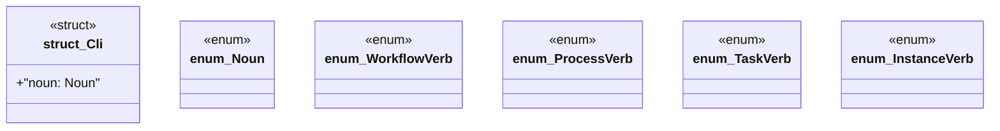

# `marketplace/packages/workflow-engine-cli/src/main.rs`

Source SHA-256: `4200d9adaf6c9f525276ec4e0ed20569b488dcf9993df7a0bfc7c00b7871bcae`

## Dependencies

- `anyhow::Result`
- `clap::{Parser, Subcommand}`
- `tracing::{info, Level}`
- `tracing_subscriber::FmtSubscriber`
- `workflow_engine::prelude::*`

## Standing

- Structural parse: `ALIVE`
- Runtime behavior: `UNKNOWN`
