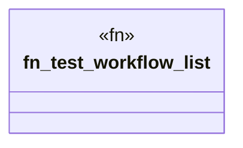

# `marketplace/packages/workflow-engine-cli/tests/integration_test.rs`

Source SHA-256: `cf0a20db4bde0a76806f41dbbe61f4c371be4ad3d24839fc068da22a20ab73f7`

## Dependencies

- `workflow_engine::prelude::*`

## Standing

- Structural parse: `ALIVE`
- Runtime behavior: `UNKNOWN`
