# `packs/affidavit-pack/reference/affidavit_v26.6.22_src/types.rs`

Source SHA-256: `2a4df43769d3f7868ed79d7779f6d4b0bc797ab35ce9f9a5cdae1c7e890437f4`

```mermaid
classDiagram
    class struct_Blake3Hash {
      <<struct>>
    }
    class struct_AffidavitReceiptChain {
      <<struct>>
    }
    class type_AdmittedReceipt {
      <<type>>
    }
    class struct_ObjectRef {
      <<struct>>
      +"id: String"
      +"obj_type: String"
      +"qualifier: Option~String~"
    }
    class struct_OperationEvent {
      <<struct>>
      +"id: String"
      +"seq: u64"
      +"event_type: String"
      +"objects: Vec~ObjectRef~"
      +"payload_commitment: Blake3Hash"
    }
    class struct_Receipt {
      <<struct>>
      +"format_version: String"
      +"events: Vec~OperationEvent~"
      +"chain_hash: Blake3Hash"
      +"_seal: ()"
    }
    class enum_ProfileId {
      <<enum>>
    }
    class struct_CheckOutcome {
      <<struct>>
      +"stage: String"
      +"passed: bool"
      +"detail: String"
    }
    class struct_Verdict {
      <<struct>>
      +"accepted: bool"
      +"profile: ProfileId"
      +"outcomes: Vec~CheckOutcome~"
      +"reason: String"
    }
    class struct_InspectionReport {
      <<struct>>
      +"event_count: usize"
      +"format_version: String"
      +"chain_hash: String"
      +"chain_integrity_valid: bool"
      +"event_types: std::collections::BTreeMap~String"
      +"object_types: std::collections::BTreeMap~String"
      +"events: Vec~EventSummary~"
    }
    class struct_EventSummary {
      <<struct>>
      +"seq: u64"
      +"id: String"
      +"event_type: String"
      +"object_count: usize"
      +"commitment: String"
    }
    class struct_EmitOutput {
      <<struct>>
      +"event_id: String"
      +"seq: u64"
      +"event_type: String"
      +"commitment: String"
    }
    class struct_AssembleOutput {
      <<struct>>
      +"receipt_path: String"
      +"content_address: String"
      +"event_count: usize"
    }
    class struct_StatsOutput {
      <<struct>>
      +"event_count: usize"
      +"chain_depth: usize"
      +"chain_hash: String"
      +"event_type_histogram: std::collections::BTreeMap~String"
      +"object_type_histogram: std::collections::BTreeMap~String"
    }
    class struct_QualityMetricValue {
      <<struct>>
      +"value: f64"
      +"description: String"
    }
    class struct_QualityMeasurement {
      <<struct>>
      +"timestamp: u64"
      +"stubs: QualityMetricValue"
      +"types: QualityMetricValue"
      +"churn: QualityMetricValue"
      +"comments: QualityMetricValue"
      +"complexity: QualityMetricValue"
      +"clippy_warnings: QualityMetricValue"
      +"rustfmt_violations: QualityMetricValue"
      +"cargo_deny_issues: QualityMetricValue"
      +"cargo_audit_vulnerabilities: QualityMetricValue"
      +"test_coverage: QualityMetricValue"
      +"doc_coverage: QualityMetricValue"
    }
    class struct_QualityViolationEvent {
      <<struct>>
      +"rule: String"
      +"metric: String"
      +"value: f64"
      +"threshold: f64"
      +"z_score: f64"
      +"severity: String"
      +"description: String"
    }
    class fn_canonical_bytes {
      <<fn>>
    }
    class mod_tests {
      <<mod>>
    }
    class fn_sort_value {
      <<fn>>
    }
    note "Blake3Hash"
    note "Deserialize~"
    note "ProfileId"
    note "Receipt"
    note "std::fmt::Display for Blake3Hash"
```

## Dependencies

- `serde::de::Error`
- `serde::{Deserialize, Deserializer, Serialize}`
- `serde_json::Value`
- `super::*`
- `wasm4pm_compat::evidence::Evidence`
- `wasm4pm_compat::state::Admitted`

## Standing

- Structural parse: `ALIVE`
- Runtime behavior: `UNKNOWN`
