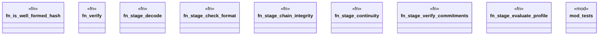

# `packs/affidavit-pack/reference/affidavit_v26.6.22_src/verifier.rs`

Source SHA-256: `0e54f356808dde3b9ec97672bc033be7d57a9da4902dc2118645a81946b55b27`

## Dependencies

- `crate::chain::{recompute_chain, FORMAT_VERSION}`
- `crate::types::{Blake3Hash, ObjectRef, OperationEvent}`
- `crate::types::{CheckOutcome, ProfileId, Receipt, Verdict}`
- `std::collections::BTreeSet`
- `super::*`

## Standing

- Structural parse: `ALIVE`
- Runtime behavior: `UNKNOWN`
