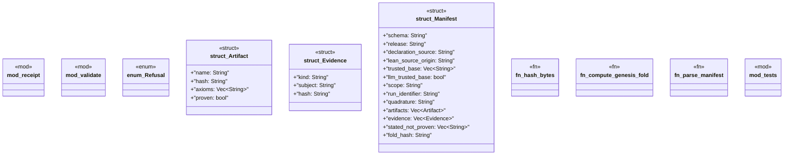

# `packs/mfact-pack/reference/mfact-core/src/lib.rs`

Source SHA-256: `63be598eff28035b36269ff84361ab52cc226c22a8ec282f31e9efa683818c29`

## Dependencies

- `serde::{Deserialize, Serialize}`
- `super::*`
- `thiserror::Error`

## Standing

- Structural parse: `ALIVE`
- Runtime behavior: `UNKNOWN`
