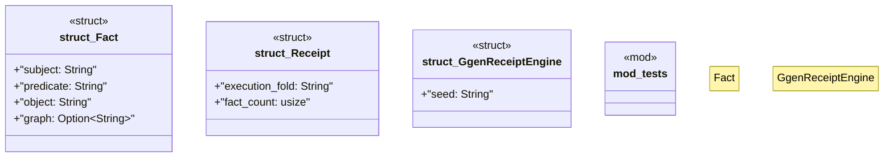

# `packs/mfact-pack/reference/mfact-core/src/receipt.rs`

Source SHA-256: `e52a3853ce3d5c503081efea666885bd2d870d3bf58a1da015479d9a553ab6c9`

## Dependencies

- `crate::{Refusal, hash_bytes}`
- `serde::{Deserialize, Serialize}`
- `super::*`

## Standing

- Structural parse: `ALIVE`
- Runtime behavior: `UNKNOWN`
