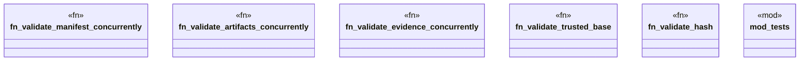

# `packs/mfact-pack/reference/mfact-core/src/validate.rs`

Source SHA-256: `5fd3031005bf51e6baf03ac577623f331ca667e4232b3422aba728fe413a0a08`

## Dependencies

- `crate::{Artifact, Evidence, Manifest, Refusal}`
- `crate::{Artifact, Evidence, Manifest}`
- `rayon::prelude::*`
- `std::collections::HashSet`
- `super::*`

## Standing

- Structural parse: `ALIVE`
- Runtime behavior: `UNKNOWN`
