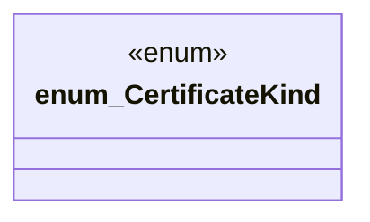

# `packs/mfw-pcp-level5-pack/consumer/mfw-pcp-generated/src/certificates.rs`

Source SHA-256: `e03b65bc91bee2b6ceb53af4e404abc402b1791613f93656db58e8ed13123baa`

## Dependencies

- `serde::{Deserialize, Serialize}`

## Standing

- Structural parse: `ALIVE`
- Runtime behavior: `UNKNOWN`
