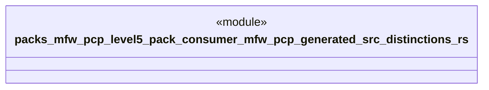

# `packs/mfw-pcp-level5-pack/consumer/mfw-pcp-generated/src/distinctions.rs`

Source SHA-256: `e48d6f4df4dd920f826fe37605c043bd027b9ce8924bf239891895468bfc317f`

## Dependencies

- None observed.

## Standing

- Structural parse: `ALIVE`
- Runtime behavior: `UNKNOWN`
