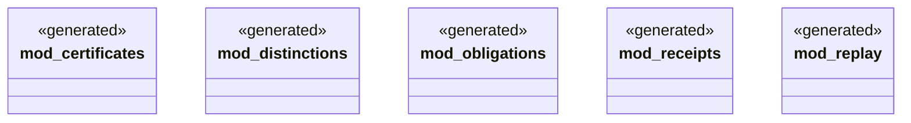

# `packs/mfw-pcp-level5-pack/consumer/mfw-pcp-generated/src/lib.rs`

Source SHA-256: `0b080cc6277297519d4a43a14553638ce2593294e2e5e01ac2478156206ec514`

## Dependencies

- None observed.

## Standing

- Structural parse: `ALIVE`
- Runtime behavior: `UNKNOWN`
