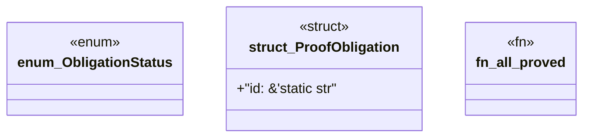

# `packs/mfw-pcp-level5-pack/consumer/mfw-pcp-generated/src/obligations.rs`

Source SHA-256: `b36171922d718fc5556456c6d722f706cf325b72363757dd60410b2a0ceea75c`

## Dependencies

- None observed.

## Standing

- Structural parse: `ALIVE`
- Runtime behavior: `UNKNOWN`
