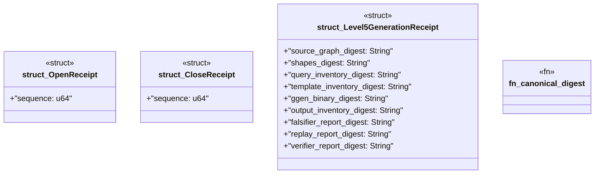

# `packs/mfw-pcp-level5-pack/consumer/mfw-pcp-generated/src/receipts.rs`

Source SHA-256: `9e4b0512877c687a19ee2a68ea88e808775defa9fe4ffd96b1a2cfa7cce9bf3e`

## Dependencies

- `serde::{Deserialize, Serialize}`

## Standing

- Structural parse: `ALIVE`
- Runtime behavior: `UNKNOWN`
