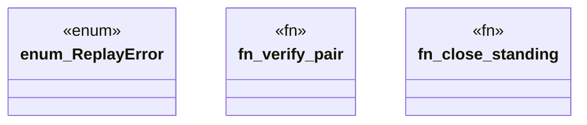

# `packs/mfw-pcp-level5-pack/consumer/mfw-pcp-generated/src/replay.rs`

Source SHA-256: `9ab2c0d991b09eaeb31d6a0485198874da374b12442d0ecb2ef82260e765f1e2`

## Dependencies

- `crate::receipts::{CloseReceipt, OpenReceipt}`
- `thiserror::Error`

## Standing

- Structural parse: `ALIVE`
- Runtime behavior: `UNKNOWN`
