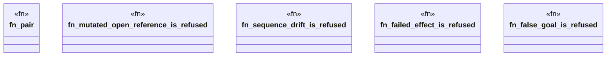

# `packs/mfw-pcp-level5-pack/consumer/mfw-pcp-generated/tests/generated_negative.rs`

Source SHA-256: `ac21563c3c3bddd5ed041b6b076b90c295d7b54b724c24d053f70f7351b96b34`

## Dependencies

- `mfw_pcp_generated::receipts::{canonical_digest, CloseReceipt, OpenReceipt}`
- `mfw_pcp_generated::replay::{close_standing, verify_pair, ReplayError}`

## Standing

- Structural parse: `ALIVE`
- Runtime behavior: `UNKNOWN`
