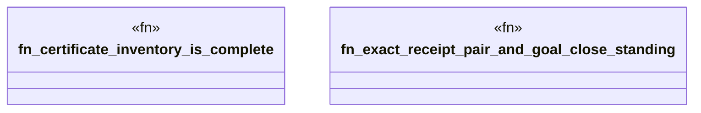

# `packs/mfw-pcp-level5-pack/consumer/mfw-pcp-generated/tests/generated_proof.rs`

Source SHA-256: `043210b9dbec4a82b9d621e9cef9d7ea492ff5368909633ebca1ac94f04ce42e`

## Dependencies

- `mfw_pcp_generated::certificates`
- `mfw_pcp_generated::receipts::{canonical_digest, CloseReceipt, OpenReceipt}`
- `mfw_pcp_generated::replay::{close_standing, verify_pair}`

## Standing

- Structural parse: `ALIVE`
- Runtime behavior: `UNKNOWN`
