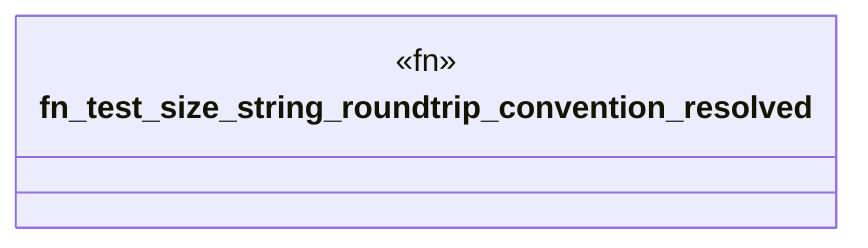

# `packs/osx-clnr-pack/reference/verbatim_size_roundtrip_test.rs`

Source SHA-256: `117b23aef56d7a9ceae1c24410162c6ca8e77e5bd1523453a4ff84e6901694f0`

## Dependencies

- `osx_clnr::{ domain::{time::parse_size_in_bytes, tool_roots::human_bytes as hb_domain}, integration::progress::human_bytes as hb_integration, }`

## Standing

- Structural parse: `ALIVE`
- Runtime behavior: `UNKNOWN`
