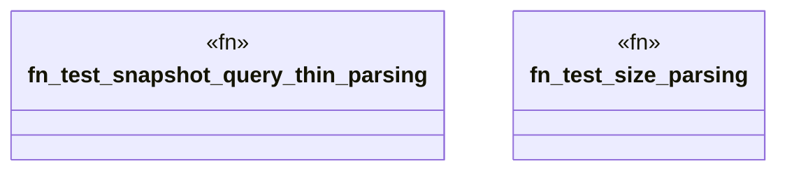

# `packs/osx-clnr-pack/reference/verbatim_time_tests.rs`

Source SHA-256: `14c560f1c7be92fd4c56782504effe6bb3013e3a787e20e2f77d6d9d465a61dd`

## Dependencies

- `osx_clnr::domain::time::parse_size_in_bytes`
- `osx_clnr::domain::time::{ identify_thinned_snapshots, parse_snapshot_date, SnapshotThinReceipt, }`

## Standing

- Structural parse: `ALIVE`
- Runtime behavior: `UNKNOWN`
