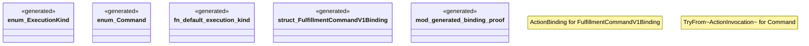

# `packs/pddl-embedded-workflow-pack/tests/embedded_workflow_generated.rs`

Source SHA-256: `55832fe6ebe503617ede56fc9011c32679752b6519923a7ee27ff49ef280f6cc`

## Dependencies

- `bcinr_pddl::prelude::*`
- `serde::Serialize`
- `std::borrow::Cow`
- `super::*`

## Standing

- Structural parse: `ALIVE`
- Runtime behavior: `UNKNOWN`
