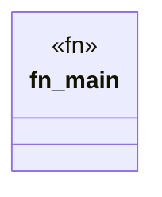

# `packs/tcps-core-pack/reference/製品版/crates/tcps-cli/src/main.rs`

Source SHA-256: `0011d2703c34dd079eee8e9394619ac375c75d7a86d44c4e8f6c5699e33c5380`

## Dependencies

- `std::process::ExitCode`
- `tcps_core::全体::豊田生産方式`
- `tcps_std::実行環境`

## Standing

- Structural parse: `ALIVE`
- Runtime behavior: `UNKNOWN`
