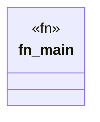

# `packs/tcps-core-pack/reference/製品版/crates/tcps-cli/src/基準.rs`

Source SHA-256: `745b6fda1c8634d38010636c8030b451048e3154760630b56af49e45e72d2c78`

## Dependencies

- `std::hint::black_box`
- `std::time::Instant`
- `tcps_core::正準::{正準方策, 正準要求}`
- `tcps_core::自動選択::{作業領域, 選択する, 選択結果}`

## Standing

- Structural parse: `ALIVE`
- Runtime behavior: `UNKNOWN`
