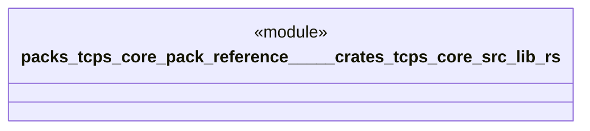

# `packs/tcps-core-pack/reference/製品版/crates/tcps-core/src/lib.rs`

Source SHA-256: `552e228f4bb61a44cad62809ffe86285252c072c1ae9f042ea442f52bf6251e9`

## Dependencies

- `かんばん::*`
- `アンドン::*`
- `タクト::*`
- `ポカヨケ::*`
- `ムリムラムダ::*`
- `五回なぜ::*`
- `人間中心::*`
- `価値流::*`
- `全体::*`
- `原点::*`
- `受領証::*`
- `品質::*`
- `安全::*`
- `工程能力::*`
- `平準化::*`
- `必要時生産::*`
- `改善::*`
- `暗号要約::*`
- `標準作業::*`
- `正準::*`
- `現地現物::*`
- `系譜::*`
- `自働化::*`
- `自動選択::*`
- `語彙::*`
- `青い川のダム::*`

## Standing

- Structural parse: `ALIVE`
- Runtime behavior: `UNKNOWN`
