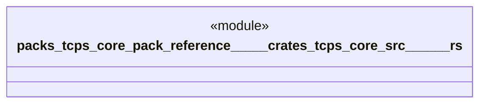

# `packs/tcps-core-pack/reference/製品版/crates/tcps-core/src/アンドン.rs`

Source SHA-256: `8a9689f72669bb2978f6ee57e9c08368f4303a56ea89de02ebcb264fc5490ed2`

## Dependencies

- `crate::品質::異常`
- `crate::語彙::{工程番号, 時刻, 成否, 有無}`

## Standing

- Structural parse: `ALIVE`
- Runtime behavior: `UNKNOWN`
