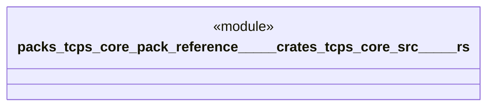

# `packs/tcps-core-pack/reference/製品版/crates/tcps-core/src/タクト.rs`

Source SHA-256: `b822c9b9321420904cdb79760f2382abef0f5330960b639153ee95c7054e4947`

## Dependencies

- `crate::語彙::{数量, 周期, 成否}`

## Standing

- Structural parse: `ALIVE`
- Runtime behavior: `UNKNOWN`
