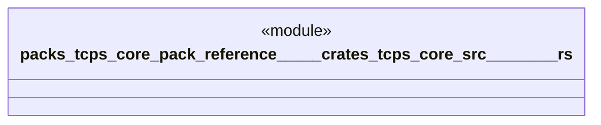

# `packs/tcps-core-pack/reference/製品版/crates/tcps-core/src/ムリムラムダ.rs`

Source SHA-256: `e5785577aa4f48da26676eb8681158b12033f48f7efbaf4dfb40129092c16a3c`

## Dependencies

- `crate::語彙::{工程番号, 数量, 時刻, 有無}`

## Standing

- Structural parse: `ALIVE`
- Runtime behavior: `UNKNOWN`
