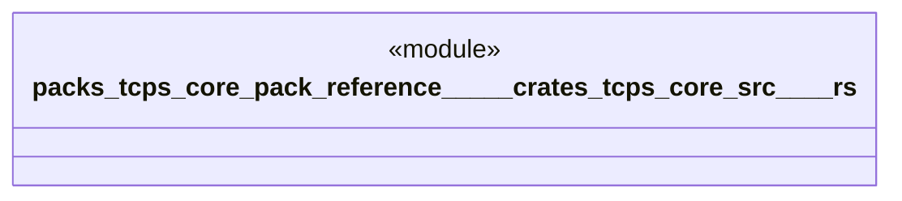

# `packs/tcps-core-pack/reference/製品版/crates/tcps-core/src/原点.rs`

Source SHA-256: `610069d620ad623e9b08c03da795d8a8483b9521c554a284a72ab852ead5a399`

## Dependencies

- `crate::語彙::{工程番号, 数量, 時刻}`

## Standing

- Structural parse: `ALIVE`
- Runtime behavior: `UNKNOWN`
