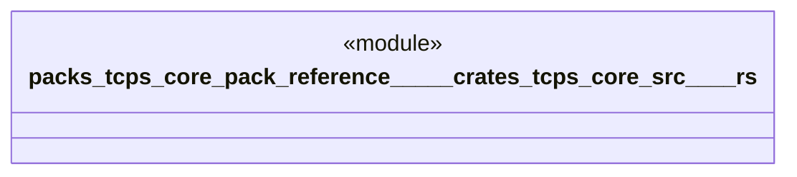

# `packs/tcps-core-pack/reference/製品版/crates/tcps-core/src/安全.rs`

Source SHA-256: `ff9ed75cf4002a7327097feb7f1c9e69a369fe628467051efd045001cf1502b9`

## Dependencies

- `crate::語彙::{成否, 理由番号}`

## Standing

- Structural parse: `ALIVE`
- Runtime behavior: `UNKNOWN`
