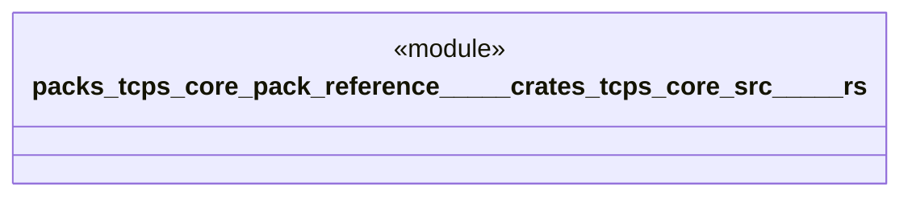

# `packs/tcps-core-pack/reference/製品版/crates/tcps-core/src/平準化.rs`

Source SHA-256: `f8dd97e2e84293e7cc4cc34f558b09f4a9f9cbd9a59f4732cfc11b4867db6569`

## Dependencies

- `crate::語彙::{工程番号, 品目番号, 数量, 成否, 有無}`

## Standing

- Structural parse: `ALIVE`
- Runtime behavior: `UNKNOWN`
