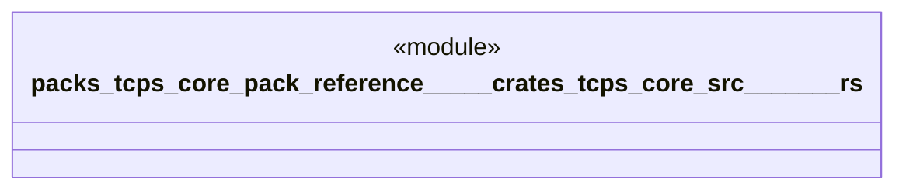

# `packs/tcps-core-pack/reference/製品版/crates/tcps-core/src/必要時生産.rs`

Source SHA-256: `f624e7d4e7d8b1b84f6e7b7876c9f1e94d65b054a77ee8b44eba4ec2045c7776`

## Dependencies

- `crate::かんばん::かんばん`
- `crate::語彙::{工程番号, 品目番号, 数量, 成否, 時刻}`

## Standing

- Structural parse: `ALIVE`
- Runtime behavior: `UNKNOWN`
