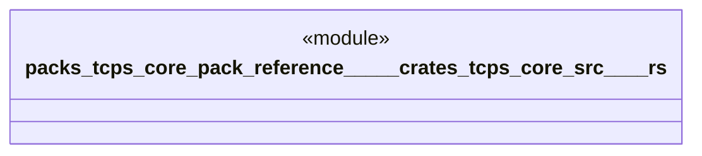

# `packs/tcps-core-pack/reference/製品版/crates/tcps-core/src/改善.rs`

Source SHA-256: `346966e157f2cb61369044f239e5923dda9c36ce79619d149cd5b02196bff1bc`

## Dependencies

- `crate::品質::異常票`
- `crate::標準作業::標準作業`
- `crate::自働化::{停止中, 再開可能, 対策中, 生産線, 稼働中}`
- `crate::語彙::{改善番号, 成否, 標準番号}`

## Standing

- Structural parse: `ALIVE`
- Runtime behavior: `UNKNOWN`
