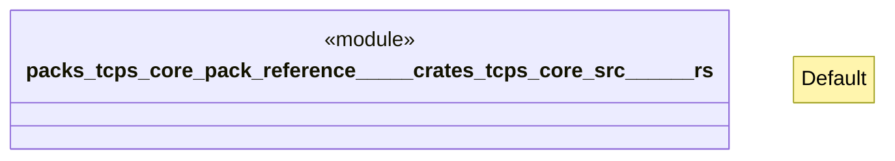

# `packs/tcps-core-pack/reference/製品版/crates/tcps-core/src/暗号要約.rs`

Source SHA-256: `ab53f2a9dc666b26f05f45724386c77ad430dd613b0f5791f3481ae19fe42409`

## Dependencies

- `crate::受領証::要約値`
- `super::*`

## Standing

- Structural parse: `ALIVE`
- Runtime behavior: `UNKNOWN`
