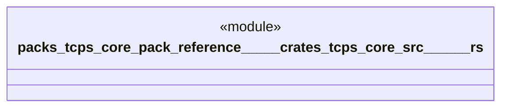

# `packs/tcps-core-pack/reference/製品版/crates/tcps-core/src/標準作業.rs`

Source SHA-256: `defb4389e00781ee182163205e73e600192ffb7046764f64c9d0090b69046ee2`

## Dependencies

- `crate::語彙::{周期, 工程番号, 数量, 成否, 有無, 標準番号}`

## Standing

- Structural parse: `ALIVE`
- Runtime behavior: `UNKNOWN`
