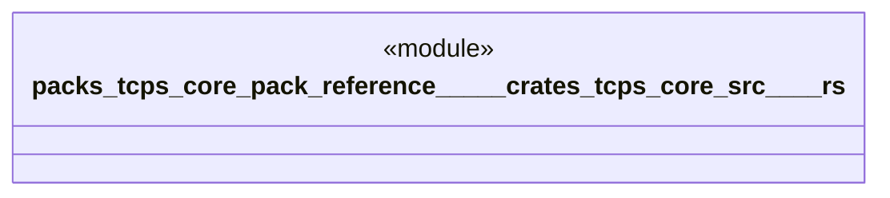

# `packs/tcps-core-pack/reference/製品版/crates/tcps-core/src/正準.rs`

Source SHA-256: `230e9f856c433bf8409cb3569cb1ee24026b395988cd9c452bcff9ef41654718`

## Dependencies

- `crate::暗号要約::シャ二五六`
- `crate::自動選択::{候補, 方策, 測度, 認知品種, 選択要求}`

## Standing

- Structural parse: `ALIVE`
- Runtime behavior: `UNKNOWN`
