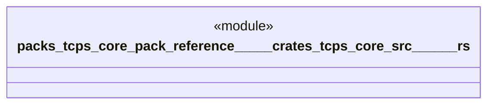

# `packs/tcps-core-pack/reference/製品版/crates/tcps-core/src/現地現物.rs`

Source SHA-256: `5cac4db294540f3c10b0899b0ab0e6ad3679b2bb000fc16485e761fb9fe82787`

## Dependencies

- `crate::品質::異常`
- `crate::語彙::{工程番号, 時刻, 有無}`

## Standing

- Structural parse: `ALIVE`
- Runtime behavior: `UNKNOWN`
