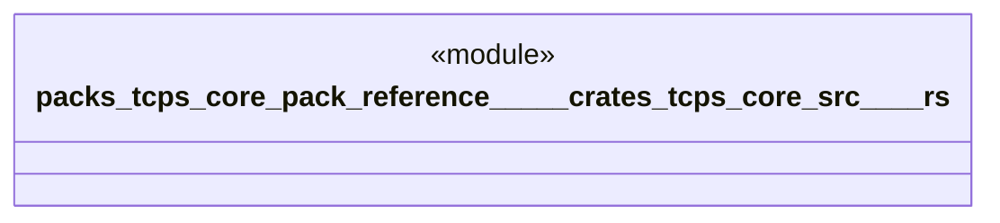

# `packs/tcps-core-pack/reference/製品版/crates/tcps-core/src/系譜.rs`

Source SHA-256: `0bed88240bdc523c62939c935a89ebe8f242cc98bccab56fffbd76081ad5d714`

## Dependencies

- `crate::語彙::{成否, 有無}`

## Standing

- Structural parse: `ALIVE`
- Runtime behavior: `UNKNOWN`
