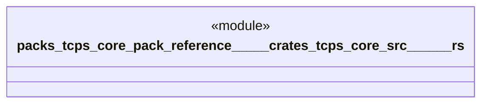

# `packs/tcps-core-pack/reference/製品版/crates/tcps-core/src/自動選択.rs`

Source SHA-256: `675e92ec97bd94b1ed727673bfb070c65ffb615786f7d08553e2aee9c2260e6e`

## Dependencies

- `crate::受領証::{受領種別, 受領証, 要約値}`
- `crate::暗号要約::シャ二五六`
- `crate::語彙::{方策番号, 時刻, 有無, 権限印, 準備印, 理由番号, 質量, 道具番号, 適格印, 経路番号}`

## Standing

- Structural parse: `ALIVE`
- Runtime behavior: `UNKNOWN`
