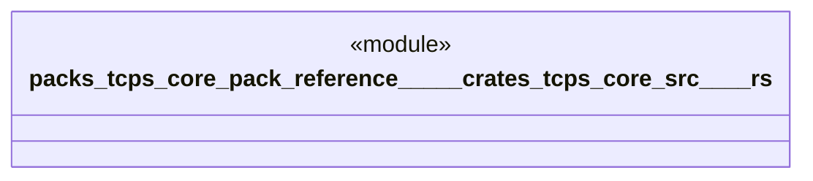

# `packs/tcps-core-pack/reference/製品版/crates/tcps-core/src/試験.rs`

Source SHA-256: `86cbdb062ad5249684346b286d0e642db31c5cdf6359cf841d08962a7dc00335`

## Dependencies

- `crate::*`

## Standing

- Structural parse: `ALIVE`
- Runtime behavior: `UNKNOWN`
