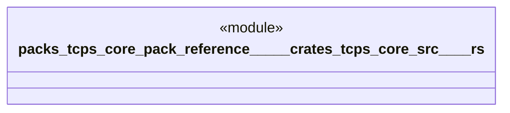

# `packs/tcps-core-pack/reference/製品版/crates/tcps-core/src/語彙.rs`

Source SHA-256: `d89979eabbe43499eb7c8529b69cc971fa4131ee27c3fc75720ab4ee8ed4acea`

## Dependencies

- None observed.

## Standing

- Structural parse: `ALIVE`
- Runtime behavior: `UNKNOWN`
