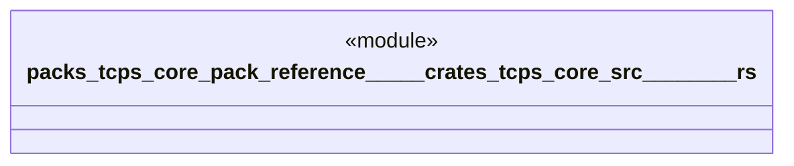

# `packs/tcps-core-pack/reference/製品版/crates/tcps-core/src/青い川のダム.rs`

Source SHA-256: `bb3fca4cda515992739eaa2dc6ec354a27925642deee8d082f231bb82591fbd4`

## Dependencies

- `crate::受領証::{受領種別, 受領証}`
- `crate::自動選択::選択提案`
- `crate::語彙::{成否, 時刻, 有無, 権限印, 道具番号}`

## Standing

- Structural parse: `ALIVE`
- Runtime behavior: `UNKNOWN`
