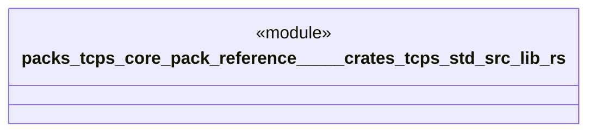

# `packs/tcps-core-pack/reference/製品版/crates/tcps-std/src/lib.rs`

Source SHA-256: `e414d1447a5d5513ac5dfcfc49879dbfd560f8b4cb46e4193dc9580d136cfdc3`

## Dependencies

- `std::fs::{self, File}`
- `std::io::{self, Write}`
- `std::path::{Path, PathBuf}`
- `std::time::{SystemTime, UNIX_EPOCH}`
- `super::*`
- `tcps_core::受領証::{受領証, 受領種別, 要約値}`
- `tcps_core::品質::異常`
- `tcps_core::語彙::{有無, 理由番号, 道具番号}`
- `tcps_core::語彙::有無`

## Standing

- Structural parse: `ALIVE`
- Runtime behavior: `UNKNOWN`
