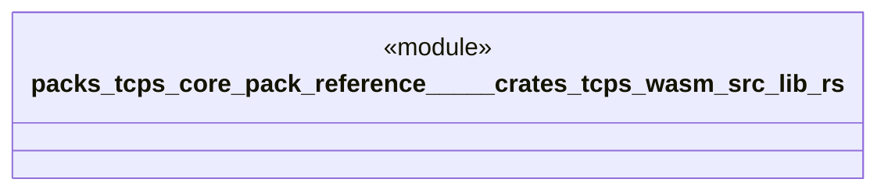

# `packs/tcps-core-pack/reference/製品版/crates/tcps-wasm/src/lib.rs`

Source SHA-256: `e5b73da5103a95a176c207c97b3bfaeac4c2726f59ee746dcf998bd73c1977fd`

## Dependencies

- `tcps_core::正準::正準方策`
- `tcps_core::自動選択::{作業領域, 選択する, 選択結果, 選択要求}`

## Standing

- Structural parse: `ALIVE`
- Runtime behavior: `UNKNOWN`
