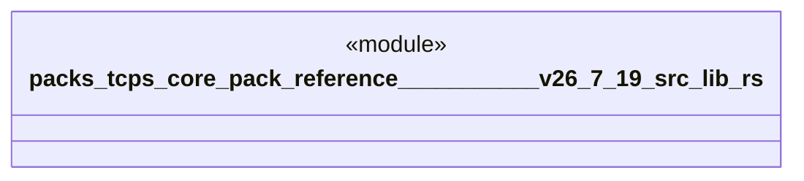

# `packs/tcps-core-pack/reference/豊田コード生産方式_v26.7.19/src/lib.rs`

Source SHA-256: `0c4cc7e1ab6e32f0066f405720dee53bcab25bd86c3060987b67363e4177b403`

## Dependencies

- `かんばん::*`
- `アンドン::*`
- `タクト::*`
- `ポカヨケ::*`
- `ムリムラムダ::*`
- `五回なぜ::*`
- `人間中心::*`
- `価値流::*`
- `全体::*`
- `原点::*`
- `受領証::*`
- `品質::*`
- `安全::*`
- `工程能力::*`
- `平準化::*`
- `必要時生産::*`
- `改善::*`
- `標準作業::*`
- `現地現物::*`
- `系譜::*`
- `自働化::*`
- `自動選択::*`
- `語彙::*`
- `青い川のダム::*`

## Standing

- Structural parse: `ALIVE`
- Runtime behavior: `UNKNOWN`
