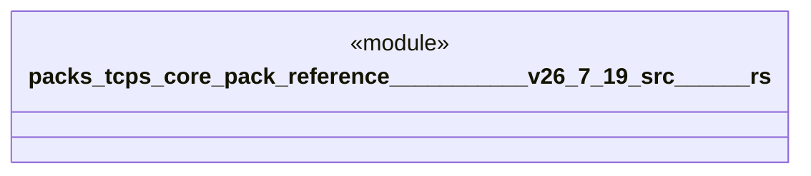

# `packs/tcps-core-pack/reference/豊田コード生産方式_v26.7.19/src/かんばん.rs`

Source SHA-256: `020ea43d4652b626197ae2bc7e0e9c04b7390b1b35312c31b0c817fb97dc80c5`

## Dependencies

- `crate::語彙::{工程番号, 品目番号, 数量, 時刻}`

## Standing

- Structural parse: `ALIVE`
- Runtime behavior: `UNKNOWN`
