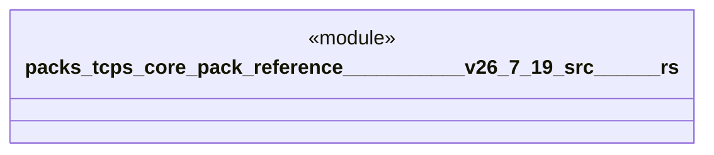

# `packs/tcps-core-pack/reference/豊田コード生産方式_v26.7.19/src/ポカヨケ.rs`

Source SHA-256: `2cf2f94d6e481f36f1d1f272d838a9c41038d49a33272501e6989297b219434c`

## Dependencies

- `crate::語彙::{成否, 理由番号}`

## Standing

- Structural parse: `ALIVE`
- Runtime behavior: `UNKNOWN`
