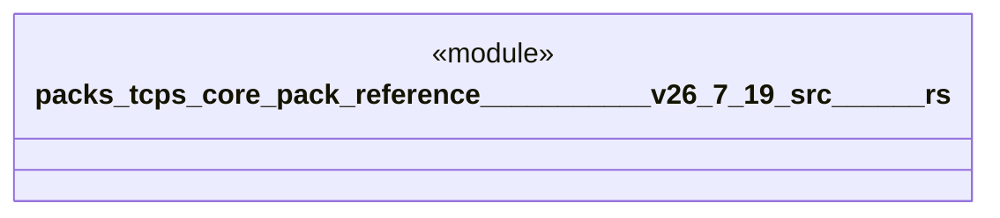

# `packs/tcps-core-pack/reference/豊田コード生産方式_v26.7.19/src/五回なぜ.rs`

Source SHA-256: `b25b2726e9a1c09fb9135766836d5585462db0ba77877f168058672e02e9ef80`

## Dependencies

- `crate::語彙::{成否, 有無}`

## Standing

- Structural parse: `ALIVE`
- Runtime behavior: `UNKNOWN`
